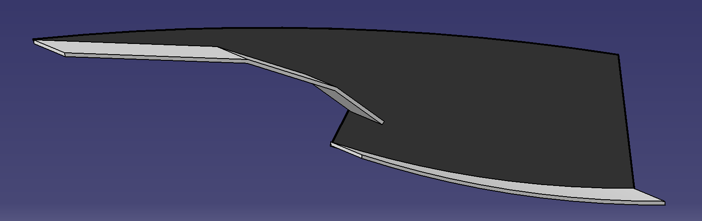

# Supersonic-Jet-Engine-Design

**Supersonic Engine Design – AER710 Final Project**

This repository presents the conceptual design and analysis of a fictional supersonic turbojet engine, capable of cruising at Mach 3.2 and completing a transatlantic flight from New York to London in under 3 hours. The engine’s performance is benchmarked against the Pratt & Whitney J58 (SR-71 Blackbird) using parametric cycle analysis and trade‑off studies.

---

## Key Features

- **Supersonic Inlet Design**  
  Multi‑shock inlet (3 oblique shocks + 1 normal shock) optimized via the Oswatitsch principle.
  
  

- **Parametric Cycle Analysis**  
  MATLAB scripts explore the engine performance across Mach 0.85, 2.0, and 3.2 and compressor pressure ratios from 1:1 to 100:1. The following figure is a turbojet engine reference display, breaking down each stage the     airflow experiences. This was used for the calculations needed to find Thrust Specific Fuel Consumption, Specific Thrust, and the efficiency.
  
  

- **Performance Trade‑offs**  
  - Specific thrust  
  - Thrust specific fuel consumption (TSFC)  
  - Thermal, propulsive, and overall efficiency

---

## Repository Structure

- [Report.pdf](./Report.pdf) — Full project report with detailed equations, figures, and conclusions.
- [presentation.pptx](./presentation.pptx) - Project Powerpoint providing a brief overview with key info and important visuals.
- [inlet_design.m](./inlet_design.m) — MATLAB code for multi‑shock inlet optimization.  
- [parametric_cycle_analysis.m](./parametric_cycle_analysis.m) — MATLAB code for non‑ideal turbojet parametric cycle modeling.  
- [inlet_design_outputs/](./inlet_design_outputs/) - Folder containing all PNG outputs from inlet_design.m
- [parametric_cycle_analysis_outputs/](./parametric_cycle_analysis_outputs/) - Folder containing all PNG outputs from parametric_cycle_analysis.m

---

## Mach 2.0 Results

Below are the key plots from our cycle analysis at Mach 2.0:

  
*Parametric cycle analysis at Mach 2.0.*

  
*Overall efficiency curve at Mach 2.0 with a maximum combustion temperature of 1600 K.*

If the turbojet engine were to be optimized for Mach 2.0, it is clear to see from the figures above that the compressor pressure ratio needs to be 
around 26. This is the ratio of the pressure of the airflow at the outlet of the compressor, to the pressure of the airflow at the intlet of the compressor.
Beyond a ratio of 26, the TSFC and Specific Thrust performance metrics become very unfavourable. The TSFC exponentially increases, and the Specific Thrust
plummets. In the report, the TSFC and Specific Thrust trends are seen and explained across the different speeds.

---

## Results Highlights

The final inlet and turbojet engine design was optimized for a cruise at Mach 3.2. At this Mach, the inlet and engine performance achieved:
- **TSFC**: 0.03 at sea‑level (improvement over typical turbojet values).  
- **Thrust‑to‑Mass Flow (Specific Thrust)**: Exceeds that of the J58 at cruise conditions.  
- **Optimal Cruise Design**: Achieves best performance at Mach 2.0 with a 9.5:1 compressor pressure ratio and turbine inlet temperature of 1700 K.

---

> _Explore the output folders to view additional generated plots and reference images._
